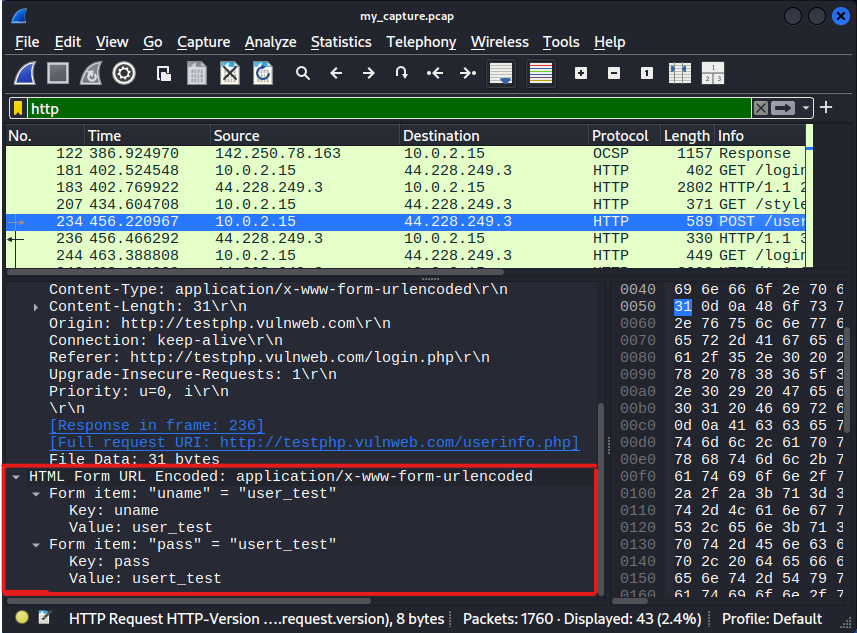

# Análise de Tráfego de Rede e Detecção de Ameaças
**Descrição:** Um projeto prático de análise de tráfego de rede e detecção de ameaças, abordando a geração e captura de dados, exploração manual com Wireshark e automação com scripts Python.

## Resumo do Projeto

Este projeto demonstra a capacidade de um Analista de Segurança para capturar, analisar manualmente e automatizar a detecção de vulnerabilidades e anomalias no tráfego de rede. Ele foca na identificação de credenciais HTTP não criptografadas e anomalias em consultas DNS, utilizando ferramentas padrão da indústria como `tcpdump`, Wireshark e scripts Python com a biblioteca Scapy.

## Objetivos do Projeto

* Capturar tráfego de rede em um ambiente controlado (VM Kali Linux).
* Realizar análise manual de tráfego HTTP e DNS usando Wireshark.
* Desenvolver um script Python para automatizar a detecção de:
    * Credenciais transmitidas em texto claro via HTTP.
    * Anomalias em consultas DNS (ex: nomes de domínio incomumente longos).
* Documentar o processo e as descobertas para um portfólio de segurança.

## Ferramentas Utilizadas

    
  

* **`Oracle VirtualBox`:** Plataforma de virtualização.
* **`Kali Linux`:** Sistema operacional para testes de penetração.

* **`tcpdump`:** Ferramenta de linha de comando para captura de pacotes.
* **`Wireshark`:** Analisador de protocolos de rede com interface gráfica.
* **`Python 3`:** Linguagem de programação.
* **`Scapy`:** Biblioteca Python para manipulação e análise de pacotes de rede.

## Fases do Projeto

### Fase 1: Geração e Captura de Tráfego

* **Descrição:** Nesta fase, um ambiente de laboratório foi configurado e tráfego de rede específico foi gerado (consultas DNS e uma tentativa de login HTTP não criptografado) enquanto o tráfego era capturado usando `tcpdump`.

* **Verificação de Ferramentas e Comandos:**
    * A disponibilidade de ferramentas de consulta DNS como `nslookup`, `dig` e `host` foi verificada.

    
    
    

* **Identificação da Interface de Rede:**
    * A interface de rede ativa para a captura de tráfego foi identificada.

    

* **Captura de Tráfego com `tcpdump`:**
    * A captura de tráfego foi iniciada em segundo plano enquanto as atividades de rede eram geradas.

    
* **Resumo da Captura:**
    * Resultados finais da captura do `tcpdump` (`packets captured`, etc.).

    
* **Localização e Verificação do Arquivo de Captura:**
    * Após a captura, foi utilizado o comando `ls -l` para listar o arquivo `.pcap` gerado, verificar sua localização e entender as permissões de acesso associadas a ele. Isso garante que o arquivo esteja pronto para a análise subsequente.

    
    
    *Nota: A imagem mostra a nomenclatura de permissões de arquivo em Linux (ex., `-rw-r--r--`) e a confirmação do caminho do arquivo.*

    > **Nomenclatura de Permissões de Arquivo no Linux (`drwxr-xr-x`)**
    >
    > A sequência de 10 caracteres como `drwxr-xr-x` na saída do `ls -l` define as permissões de acesso a arquivos e diretórios no Linux.
    >
    > O primeiro caractere (`d` ou `-`) indica o tipo de arquivo (`d` para diretório, `-` para arquivo regular).
    >
    > Os nove caracteres seguintes são divididos em três grupos de três, representando as permissões para:
    >
    > Proprietário (`rwx`): O que o dono do arquivo/diretório pode fazer.
    > 
    > Grupo (`r-x`): O que os membros do grupo podem fazer.
    > 
    > Outros (`r-x`): O que qualquer outro usuário pode fazer.
    > 
    > Dentro de cada grupo, as letras indicam as permissões:
    > 
    > `r`: leitura (read)
    > 
    > `w`: escrita (write)
    > 
    > `x`: execução (execute)
    > 
    > `-`: indica a ausência de uma permissão específica.
    > 
    > Essa nomenclatura é essencial para a gestão de segurança e organização de arquivos em sistemas Linux.

### Fase 2: Exploração Manual com Wireshark

* **Descrição:** O Wireshark foi utilizado para uma análise detalhada e manual do arquivo `.pcap` capturado, validando a presença do tráfego esperado e a vulnerabilidade das credenciais HTTP.

* **Arquivo PCAP Aberto no Wireshark:**
    * Visão geral do Wireshark com o arquivo de captura carregado.

    

* **Detecção de Credenciais HTTP Não Criptografadas:**
    * Uso de filtros de exibição (`http` e `http.request.method == POST`) para isolar o tráfego e encontrar as credenciais de login em texto claro.

    

* **Análise de Consultas DNS:**
    * Uso do filtro `dns` para inspecionar as consultas e respostas DNS geradas.

    

### Fase 3: Scripting em Python para Análise Automatizada

* **Descrição:** Um script Python (`pcap_analyzer.py`) foi desenvolvido utilizando a biblioteca Scapy para automatizar a detecção de credenciais HTTP em texto claro e anomalias básicas em consultas DNS.

* **Configuração do Ambiente Python:**
    * Instalação da biblioteca Scapy em um ambiente virtual (`venv`).

    

* **Execução do Script - Detecção HTTP:**
    * A saída do script mostrando a identificação automatizada de credenciais HTTP não criptografadas.

    

* **Execução do Script - Análise DNS:**
    * A saída do script mostrando o resultado da análise de anomalias DNS.

    

* **Código do Script (`pcap_analyzer.py`):**
    Para ver o código-fonte completo do script Python utilizado neste projeto, por favor, acesse o arquivo `pcap_analyzer.py` diretamente neste repositório.

    [Acessar pcap_analyzer.py](pcap_analyzer.py)

    *Nota: O código-fonte mantém a padronização de nomes de variáveis/funções e mensagens de saída (prints) em inglês, enquanto os comentários internos são em português para facilitar a compreensão.*

## Conclusões e Aprendizados

Este projeto me permitiu compreender e aplicar o ciclo de vida de um incidente de segurança em um nível básico: desde a captura de dados até sua análise automatizada. Os aprendizados chave incluem:

* A importância das ferramentas de linha de comando (`tcpdump`) para a coleta de dados.
* O poder da análise manual com Wireshark para compreender a fundo os protocolos.
* Como a automação com Python e Scapy escala a capacidade de detecção de um analista.
* A crítica necessidade de criptografia para proteger dados sensíveis como as credenciais.
* A utilidade de buscar anomalias em protocolos como DNS para identificar possíveis atividades maliciosas.

## Possíveis Melhorias Futuras

* Implementar análises mais sofisticadas de DNS (ex., detecção de túneis DNS baseada em entropia ou frequência).
* Estender o script para analisar outros protocolos (FTP, SMTP) em busca de credenciais.
* Integrar o script com sistemas de alerta (ex., enviar notificações por e-mail ou para um SIEM).
* Desenvolver uma interface de usuário básica para o script.
